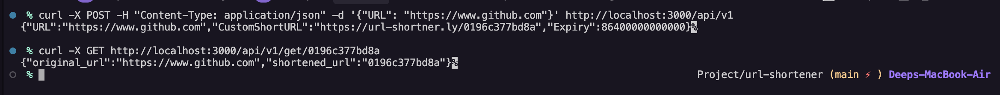

# URL Shortener Service

A  URL shortener service built with Go and Kvrocks that allows users to create shortened URLs with optional custom IDs and expiration times.

## Setup and Running

### Prerequisites
- Docker and Docker Compose

### Starting the Service
```bash
# Clone the repository
# Start the service
docker-compose up -d
```

The service will be available at `http://localhost:3000`


## API Documentation

### Shorten URL
**Endpoint:** `POST /api/v1`

**Request Body:**
```json
{
  "URL": "https://example.com/long-url-to-be-shortened",
  "CustomShortURL": "custom-id",  // Optional
  "Expiry": 3600000000000         // Optional, in nanoseconds (default: 1 hour)
}
```

**Response:**
```json
{
  "URL": "https://example.com/long-url-to-be-shortened",
  "CustomShortURL": "https://url-shortner.ly/custom-id",
  "Expiry": 3600000000000
}
```

**Sample Request:**
```bash
curl -X POST -H "Content-Type: application/json" \
  -d '{"URL": "https://www.github.com"}' \
  http://localhost:3000/api/v1
```


### Retrieve Original URL
**Endpoint:** `GET /api/v1/get/:url`

**Response:**
```json
{
  "shortened_url": "custom-id",
  "original_url": "https://example.com/long-url-to-be-shortened"
}
```

**Sample Request:**
```bash
curl -X GET http://localhost:3000/api/v1/get/0196c36a575a
```

**Screenshot of Working Requests:**



## Technical Details
- Backend: Go with Fiber framework
- Database: Kvrocks (Redis-compatible)
- Containerized with Docker

## Distributed Deployment

The URL shortener service can be easily deployed in a distributed environment, leveraging Kvrocks' distributed database capabilities:

### Architecture
1. Run Kvrocks instances on separate nodes in a cluster configuration
2. Deploy multiple instances of the URL shortener application on different servers
3. Use a load balancer to distribute traffic among application instances
